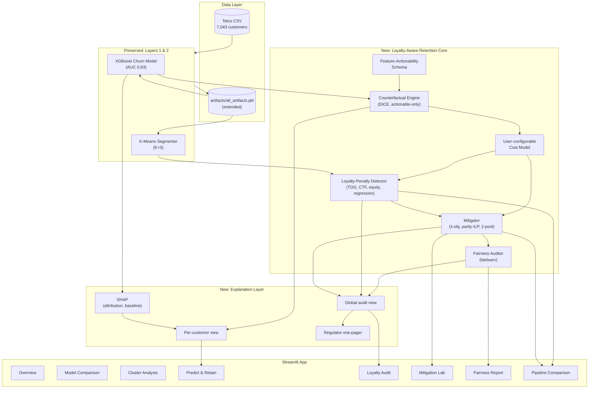
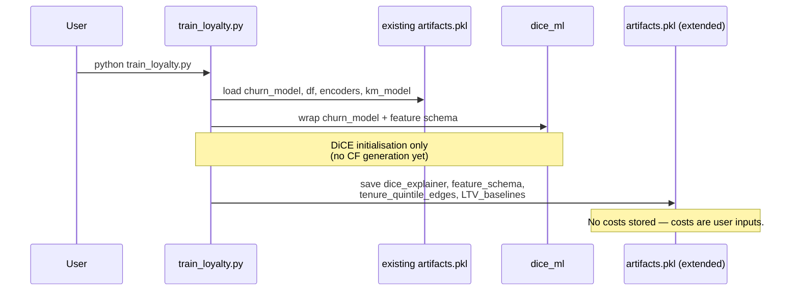
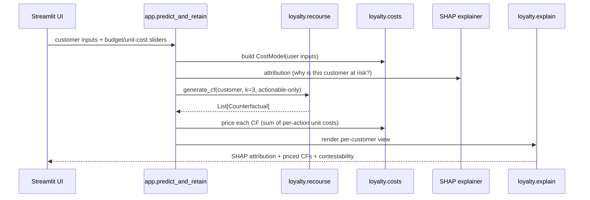
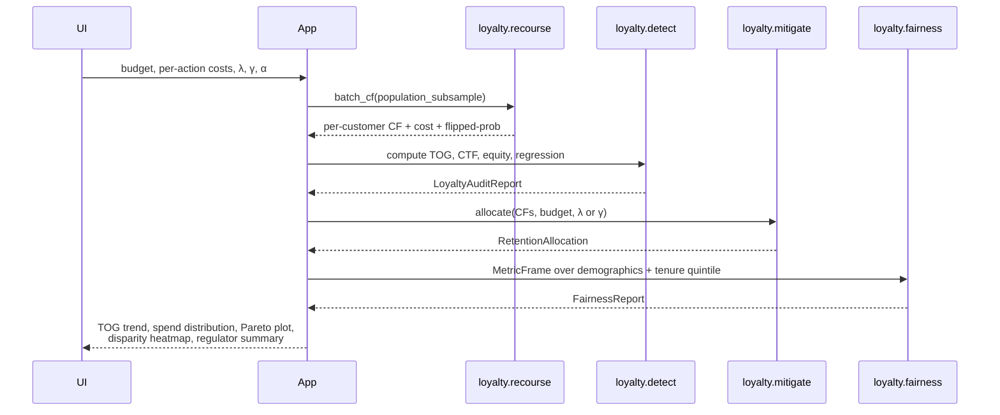

# Design Document: Loyalty-Aware Retention

> **Thesis framing:** *Auditing the Loyalty Penalty: Detecting and Mitigating Tenure-Based Price Discrimination in Automated Retention Systems.*

---

## 1. Overview

Standard churn-prediction + retention pipelines (XGBoost scoring → top-K churners → retention offer) structurally channel spend toward high-churn-probability customers. Because churn probability is strongly (negatively) correlated with tenure on the Telco dataset and on most real-world retention systems, this produces an implicit **tenure-based price discrimination**: long-tenured, loyal, high-lifetime-value customers get *less* retention investment per dollar of expected LTV than short-tenured flight-risks do. This is the **algorithmic realisation of the "loyalty penalty"** — a harm already measured by the UK CMA, Citizens Advice, and active (2026) class actions against Three / O2 / EE / Vodafone, but not yet treated as an ML-audit problem.

This feature adds six capabilities on top of the existing Layer 1 (XGBoost churn), Layer 2 (K-Means segmentation), and Layer 3 (SHAP + rule-based retention) stack:

1. **Actionable counterfactual recourse** via Microsoft DiCE, constrained to features the firm can actually change (Contract, add-ons, PaymentMethod, MonthlyCharges), not immutable attributes (tenure, gender, SeniorCitizen).
2. **Loyalty-penalty detection**: Tenure–Offer Gap (TOG), Counterfactual Tenure Flip (CTF), cluster-level spend-per-LTV equity, and a regression audit.
3. **Loyalty-penalty mitigation**: a λ-penalised retention objective (core contribution), a parity-constrained ILP (policy lever), and a two-pool budget split.
4. **Fairness audit** across gender, SeniorCitizen, Partner, Dependents, cluster, and tenure-quintile using `fairlearn.metrics.MetricFrame`.
5. **Transparent explanation layer** with per-customer, global-audit, and regulator-facing views.
6. **Comparative validation** of four pipelines (SHAP baseline, DiCE-unconstrained, λ-penalised, parity-ILP) on retained LTV, retention spend, TOG, and fairness metrics.

The existing Layer 1 and Layer 2 are **preserved unchanged**. SHAP is demoted from *prescription* to *attribution* and kept as a baseline in Phase 6. Costs are treated as **user-configurable inputs**, not hard-coded: the system shows the consequences of the user's assumptions rather than pretending to know them.

---

## 2. High-Level Design

### 2.1 System Architecture



**Module boundaries:**

| Module | Responsibility | Depends on |
|---|---|---|
| `loyalty.features` | Declare actionable / partially-actionable / non-actionable feature sets. | none |
| `loyalty.costs` | Build a `CostModel` from user inputs (budget, per-action unit costs). | features |
| `loyalty.recourse` | DiCE wrapping, counterfactual generation, post-hoc validation. | features, costs, churn_model |
| `loyalty.detect` | TOG, CTF, cluster-equity, regression audit. | recourse, costs, km_model |
| `loyalty.mitigate` | λ-penalised objective, parity-ILP, 2-pool allocator. | detect, costs |
| `loyalty.fairness` | `MetricFrame`-based disparity reporting. | mitigate |
| `loyalty.explain` | Per-customer, global, regulator renderers. | all of the above |
| `loyalty.validate` | 4-pipeline comparison harness (A/B/C/D). | all of the above |
| `app.py` (extended) | 4 new Streamlit tabs wired to the modules. | all of the above |

### 2.2 Data-Flow Diagrams

**Training-time (one-off, additive to `train_all.py`):**



**Per-customer inference (Streamlit "Predict & Retain" tab):**



**Global audit (Streamlit "Loyalty Audit" / "Mitigation Lab" tabs):**



### 2.3 Streamlit App Structure (existing tabs preserved, 4 new tabs added)

| Tab | Inputs | Visualisations |
|---|---|---|
| Overview *(existing)* | — | EDA, churn drivers. |
| Model Comparison *(existing)* | — | 5-model AUC/F1 comparison. |
| Cluster Analysis *(existing)* | — | K-Means segment profiles. |
| **Predict & Retain** *(extended)* | Customer form; `unit_cost_*` sliders. | SHAP + **DiCE counterfactuals (priced)**; old `RETENTION_STRATEGIES` shown as "baseline". |
| **Loyalty Audit** *(new)* | Sample size, tenure-quintile cutoffs. | TOG quintile bars; CTF scatter (real vs synthetic-short); cluster spend-per-LTV; regression coefficient table. |
| **Mitigation Lab** *(new)* | `total_budget`, `λ` slider, `γ` slider, `α` slider. | λ vs (LTV, TOG) Pareto curve; ILP feasibility badge; before/after spend distribution. |
| **Fairness Report** *(new)* | Protected attributes multiselect. | `MetricFrame` heatmap; demographic-parity/selection-rate deltas; fairness-vs-utility trade-off. |
| **Pipeline Comparison** *(new)* | Pipeline selector (A/B/C/D). | 4-pipeline table: retained LTV, spend, TOG, % actions on non-actionable features. |

### 2.4 Artifact / Storage Design

The existing `artifacts/all_artifacts.pkl` is **extended** (no field removed). Everything related to *cost* is computed on-the-fly from user inputs — nothing about cost is pickled.

| Field | Status | Content |
|---|---|---|
| `churn_model`, `km_model`, `km_scaler`, `shap_explainer`, `df`, `encoders`, `feature_cols`, `feature_display_names`, `model_comparison`, `feature_scaler`, `cluster_feature_names`, `best_k` | **existing, unchanged** | as today |
| `feature_schema` | **new** | `ActionabilitySchema` object (see §3.2) |
| `dice_data` | **new** | `dice_ml.Data` wrapper over `df` |
| `dice_model` | **new** | `dice_ml.Model` wrapping `churn_model` |
| `dice_explainer` | **new** | `dice_ml.Dice(dice_data, dice_model, method='random')` |
| `tenure_quintile_edges` | **new** | `np.ndarray` shape (6,): the 5-quintile cut-points |
| `ltv_baselines` | **new** | Per-quintile mean LTV; used as audit reference |
| `loyalty_definition` | **new** | `{"strict": "...", "lenient": "..."}` — kept as metadata |

Computed on the fly (never pickled): counterfactuals for the whole population, cost models, allocations, fairness reports.

---

## 3. Low-Level Design

### 3.1 Python Module / File Layout

Extends the existing project; nothing is moved.

```
telco-churn/
├── app.py                         # EXISTING — add 4 new tabs
├── train_all.py                   # EXISTING — unchanged
├── train_layer1.py                # EXISTING — unchanged
├── train_layer2.py                # EXISTING — unchanged
├── train_loyalty.py               # NEW — fits DiCE, saves new artifacts
├── loyalty/                       # NEW package
│   ├── __init__.py
│   ├── features.py                # ActionabilitySchema
│   ├── costs.py                   # CostModel (from user inputs)
│   ├── recourse.py                # DiCE wrapper, CounterfactualResult
│   ├── detect.py                  # TOG, CTF, equity, regression
│   ├── mitigate.py                # λ-obj, parity-ILP, 2-pool
│   ├── fairness.py                # fairlearn MetricFrame wrapper
│   ├── explain.py                 # per-customer / global / regulator renderers
│   └── validate.py                # 4-pipeline comparison harness
├── artifacts/
│   └── all_artifacts.pkl          # extended by train_loyalty.py
└── requirements-loyalty.txt       # dice-ml, pulp, fairlearn, statsmodels
```

### 3.2 Core Data Structures

```python
# loyalty/features.py
from dataclasses import dataclass, field
from typing import Literal

Actionability = Literal["actionable", "non_actionable", "partial"]

@dataclass(frozen=True)
class ActionabilitySchema:
    """
    Partition of the 19 Telco features by what the firm can change.
    Used as a hard constraint in DiCE (features_to_vary) and as an
    invariant in Mitigator/Validator ("no action modifies a non-actionable
    feature").
    """
    actionable: frozenset[str] = frozenset({
        "Contract", "OnlineSecurity", "OnlineBackup", "DeviceProtection",
        "TechSupport", "StreamingTV", "StreamingMovies",
        "PaymentMethod", "PaperlessBilling", "MonthlyCharges",
    })
    partial: frozenset[str] = frozenset({
        "InternetService",   # can upsell DSL→Fiber or cross-sell, not always freely variable
        "MultipleLines",     # depends on PhoneService
    })
    non_actionable: frozenset[str] = frozenset({
        "tenure", "gender", "SeniorCitizen", "Partner", "Dependents",
        "TotalCharges",      # derived from tenure * MonthlyCharges, effectively non-actionable
    })

    def classify(self, feature: str) -> Actionability: ...
    def varying(self, include_partial: bool = True) -> list[str]: ...
```

```python
# loyalty/costs.py
from dataclasses import dataclass

@dataclass
class CostModel:
    """
    Built from user-provided Streamlit inputs; NEVER hard-coded.
    Unit costs represent the firm's *assumption* about the cost of
    each action. The system displays consequences of this assumption.
    """
    total_budget: float                       # USD, user slider
    unit_cost: dict[str, float]               # per feature-change, user sliders
    loyalty_pool_fraction: float = 0.0        # α for 2-pool split (§3.7)

    def price(self, change: dict[str, tuple]) -> float:
        """Price a single counterfactual: sum of unit costs of changed features."""
        return sum(self.unit_cost.get(k, 0.0) for k in change)
```

```python
# loyalty/recourse.py
from dataclasses import dataclass
import pandas as pd

@dataclass
class CounterfactualResult:
    customer_id: int                          # row index in df
    original_features: dict                   # full 19-feature snapshot
    changes: dict[str, tuple]                 # {feature: (old, new)}
    flipped_prob: float                       # P(churn) under the CF
    cost: float                               # priced via CostModel
    tenure: int                               # carried for TOG/CTF audits
    predicted_ltv: float                      # baseline LTV (see §3.4)

    def touches_only_actionable(
        self, schema: "ActionabilitySchema"
    ) -> bool:
        return all(schema.classify(k) != "non_actionable" for k in self.changes)
```

```python
# loyalty/detect.py
from dataclasses import dataclass

@dataclass
class LoyaltyAuditReport:
    tog: float                                # Tenure-Offer Gap
    tog_by_quintile: list[float]              # avg offer per quintile
    ctf_deltas: list[float]                   # per-customer CTF deltas
    ctf_mean: float
    ctf_significant: bool                     # paired t-test p < 0.05
    cluster_equity: dict[int, float]          # cluster_id → spend / LTV
    regression_tenure_coef: float             # with sign
    regression_tenure_pvalue: float
    verdict: str                              # "loyalty penalty present" / "not detected"
```

```python
# loyalty/mitigate.py
from dataclasses import dataclass

@dataclass
class RetentionAllocation:
    selected: list[int]                       # customer row indices receiving an offer
    spend: dict[int, float]                   # customer_id → cost of offered CF
    total_spend: float
    retained_ltv_estimate: float              # Σ predicted_ltv_i * (1 - flipped_prob_i)
    tog_after: float                          # post-allocation TOG
    lambda_used: float | None
    gamma_used: float | None
```

```python
# loyalty/fairness.py
from dataclasses import dataclass

@dataclass
class FairnessReport:
    metric_frame: "fairlearn.metrics.MetricFrame"  # selection-rate, mean-offer per group
    demographic_parity_diff: dict[str, float]
    selection_rate_by_group: dict[str, dict[str, float]]
    tog_by_group: dict[str, dict[str, float]]      # TOG computed within each protected group
    limitations: list[str]                         # e.g., "No race/ethnicity in Telco"
```

### 3.3 Key Function Signatures with Formal Specifications

#### `recourse.generate_counterfactual`

```python
def generate_counterfactual(
    customer: pd.DataFrame,           # 1-row DataFrame in encoded space
    churn_model,                      # sklearn-compatible, predict_proba
    schema: ActionabilitySchema,
    dice_explainer,                   # pre-built dice_ml.Dice
    costs: CostModel,
    k: int = 3,                       # number of CFs to return
    desired_class: int = 0,           # 0 = "non-churn"
    proximity_weight: float = 0.5,
    diversity_weight: float = 1.0,
) -> list[CounterfactualResult]
```

**Preconditions**
- `customer.shape == (1, n_features)` with columns matching `churn_model`'s training schema.
- `churn_model.predict_proba(customer)[0, 1] > 0.5` (only generate recourse for predicted churners).
- `dice_explainer` was initialised with the same feature schema.
- `costs.unit_cost` defines a cost for every feature in `schema.actionable ∪ schema.partial`.

**Postconditions**
- Returns `0 ≤ len(result) ≤ k` `CounterfactualResult`s (may be fewer if DiCE can't find any).
- `∀ cf ∈ result: cf.touches_only_actionable(schema) == True`  *(core invariant C1)*.
- `∀ cf ∈ result: cf.flipped_prob < 0.5`.
- `∀ cf ∈ result: cf.cost == costs.price(cf.changes)`.
- `cf.original_features["tenure"]` is preserved (never modified) in every returned CF.
- No mutation of `customer`, `churn_model`, `schema`, or `costs`.

**Loop invariants:** N/A (DiCE's internal search is opaque; we enforce invariants post-hoc and *filter* any CF that violates C1 — see §3.5 algorithm).

---

#### `detect.tenure_offer_gap`

```python
def tenure_offer_gap(
    cfs: list[CounterfactualResult],
    tenure_quintile_edges: np.ndarray,
) -> tuple[float, list[float]]
```

**Preconditions**
- `cfs` is non-empty and homogeneous (same `CostModel` used to price them).
- `tenure_quintile_edges` has exactly 6 elements (5 quintiles).

**Postconditions**
- Returns `(tog, per_quintile_mean_offer)` where `tog = per_quintile_mean_offer[0] / per_quintile_mean_offer[-1]`.
- `tog > 1.0` ⇒ shortest-tenure quintile is offered more than longest-tenure quintile (loyalty penalty direction).
- If every customer in any quintile has cost 0, returns `tog = float("inf")` instead of dividing by zero.
- Deterministic: same input produces same output.

**Loop invariants:** while bucketing, for every customer processed so far, its tenure lies in exactly one quintile.

---

#### `detect.counterfactual_tenure_flip`

```python
def counterfactual_tenure_flip(
    long_tenure_customers: pd.DataFrame,
    churn_model,
    dice_explainer,
    schema: ActionabilitySchema,
    costs: CostModel,
    synthetic_tenure: int = 3,
    synthetic_contract_code: int = 0,   # Month-to-month
) -> tuple[list[float], float, bool]
```

**Preconditions**
- `long_tenure_customers["tenure"].min() ≥ 48`.
- `"tenure"` and `"Contract"` columns exist in encoded space.

**Postconditions**
- Returns `(per_customer_deltas, mean_delta, is_significant)` where
  `delta_i = cost(cf_of_synthetic_twin_i) − cost(cf_of_real_i)`.
- `mean_delta > 0` ⇒ the *same customer* attracts a bigger retention offer when their tenure is synthetically reduced — direct, per-customer evidence of the loyalty penalty.
- `is_significant` iff paired t-test p-value < 0.05.
- No mutation of `long_tenure_customers`.

**Loop invariants:** for every iteration `i`, the synthetic twin differs from the real customer in exactly `{tenure, Contract}` and nothing else.

---

#### `mitigate.lambda_penalised_allocate` *(core novelty)*

```python
def lambda_penalised_allocate(
    cfs: list[CounterfactualResult],
    budget: float,
    lam: float,                       # λ ≥ 0
    tenure_quintile_edges: np.ndarray,
) -> RetentionAllocation
```

**Preconditions**
- `budget > 0`, `lam ≥ 0`.
- `∀ cf: cf.predicted_ltv ≥ 0, cf.cost ≥ 0, 0 ≤ cf.flipped_prob ≤ 1`.

**Postconditions**
- `total_spend ≤ budget`.
- When `lam == 0`, the allocation recovers the **budget-constrained greedy LTV** baseline *(invariant C2)*.
- When `lam → ∞`, the allocation concentrates on the longest-tenure quintile (subject to budget) *(invariant C3)*.
- `selected` contains indices `i` maximising
  `Σ_i x_i · (predicted_ltv_i · (1 − flipped_prob_i)) − lam · TOG(x)`
  subject to `Σ_i x_i · cost_i ≤ budget, x_i ∈ {0,1}`.
- The objective is monotone non-increasing in `lam` on the retained-LTV axis and monotone non-increasing in `lam` on the TOG axis (trade-off is a Pareto frontier).
- Deterministic given identical inputs (MILP solver with fixed seed / default tie-breaking).

**Loop invariants (outer Pareto sweep):**
- For every `lam` tested, the solution returned is feasible (`total_spend ≤ budget`).
- As `lam` increases monotonically, `tog_after` weakly decreases.

---

#### `mitigate.parity_constrained_allocate`

```python
def parity_constrained_allocate(
    cfs: list[CounterfactualResult],
    budget: float,
    gamma: float,                     # γ ∈ [0, 1]; 1.0 ⇒ equal offer across quintiles
    tenure_quintile_edges: np.ndarray,
) -> RetentionAllocation
```

**Preconditions**
- `0 ≤ gamma ≤ 1`.
- CFs cover all five tenure quintiles (else the constraint is vacuous — we warn).

**Postconditions**
- `total_spend ≤ budget`.
- `mean_offer_in_top_quintile ≥ gamma · mean_offer_in_bottom_quintile` *(parity constraint, invariant C4)*.
- When `gamma == 0`, reduces to the pure LTV-maximising baseline.
- When `gamma == 1`, mean offer is forced equal across the top and bottom quintiles (may be infeasible → returns `selected = []` with a diagnostic).
- Implemented as a 0/1 ILP via `pulp` (see §3.5).

---

#### `fairness.audit`

```python
def audit(
    allocation: RetentionAllocation,
    df: pd.DataFrame,
    protected_attrs: list[str],
    tenure_quintile_edges: np.ndarray,
) -> FairnessReport
```

**Preconditions**
- `allocation.selected` indices are valid row indices in `df`.
- `protected_attrs ⊆ {"gender", "SeniorCitizen", "Partner", "Dependents", "cluster", "tenure_quintile"}`.
- `"tenure_quintile"` is derived internally if not present.

**Postconditions**
- `metric_frame` contains *at minimum* selection rate and mean offer per group.
- Every protected attribute has an explicit `demographic_parity_diff` value.
- `limitations` always contains the string `"No race/ethnicity available in Telco dataset"`.
- No mutation of `df` or `allocation`.

### 3.4 LTV Baseline (used by mitigator and auditor)

We deliberately keep LTV simple and transparent: no survival analysis, no Cox hazards — those would silently re-introduce a tenure dependence that would pollute the audit.

```python
# Used in detect.py and mitigate.py
def predicted_ltv(customer: pd.Series, horizon_months: int = 24) -> float:
    """
    LTV = MonthlyCharges * E[months retained over horizon]
    where E[months retained] is approximated as horizon * (1 - churn_prob_in_12mo).
    churn_prob_in_12mo is taken from the XGBoost model.
    """
    ...
```

**Why this form:** `predicted_ltv` is a function of `MonthlyCharges` and `churn_prob`, *not* of `tenure` directly. If TOG/CTF detect a loyalty penalty against this LTV proxy, we cannot dismiss it as "we just happen to under-serve long-tenure customers because their LTV is lower" — by construction, long-tenure customers have *higher* expected LTV under this proxy because their churn probability is lower.

### 3.5 Algorithmic Pseudocode with Formal Specs

#### 3.5.1 Counterfactual generation with actionability filter

```pascal
ALGORITHM generateActionableCF(customer, model, schema, dice, costs, k)
INPUT:   customer ∈ R^n, model, schema, dice explainer, costs, k ∈ N
OUTPUT:  results: List<CounterfactualResult>, 0 ≤ |results| ≤ k

PRECONDITION:
  - model.predict_proba(customer)[1] > 0.5
  - schema.varying() ⊆ columns(customer)

BEGIN
  varying_features ← schema.varying(include_partial=true)
  raw_cfs ← dice.generate_counterfactuals(
              customer,
              total_CFs = k * 3,               // over-generate, we'll filter
              desired_class = 0,
              features_to_vary = varying_features,
              proximity_weight = 0.5,
              diversity_weight = 1.0)

  results ← []
  FOR each cf IN raw_cfs DO
    changes ← diff(customer, cf)

    // INVARIANT: changes never contains a non-actionable feature.
    ASSERT ∀ feat ∈ keys(changes): schema.classify(feat) ≠ "non_actionable"

    flipped_prob ← model.predict_proba(cf)[1]
    IF flipped_prob ≥ 0.5 THEN CONTINUE             // DiCE sometimes under-flips
    cost ← costs.price(changes)
    ltv  ← predicted_ltv(customer)

    results.append(CounterfactualResult(
      customer_id = customer.index,
      original_features = customer.to_dict(),
      changes = changes,
      flipped_prob = flipped_prob,
      cost = cost,
      tenure = customer["tenure"],
      predicted_ltv = ltv))

    IF len(results) == k THEN BREAK
  END FOR

  POSTCONDITION:
    - ∀ r ∈ results: r.touches_only_actionable(schema) = true
    - ∀ r ∈ results: r.flipped_prob < 0.5
    - ∀ r ∈ results: r.cost = costs.price(r.changes)

  RETURN results
END
```

#### 3.5.2 Tenure–Offer Gap (TOG)

```pascal
ALGORITHM tenureOfferGap(cfs, quintile_edges)
INPUT:   cfs: List<CounterfactualResult>, quintile_edges ∈ R^6
OUTPUT:  tog ∈ R⁺ ∪ {∞}, per_quintile_means ∈ R^5

BEGIN
  bucket ← array of 5 empty lists
  FOR each cf IN cfs DO
    q ← index such that quintile_edges[q] ≤ cf.tenure < quintile_edges[q+1]
    bucket[q].append(cf.cost)

    // LOOP INVARIANT: every processed cf has been placed in exactly one bucket
  END FOR

  per_quintile_means ← [mean(b) if |b| > 0 else 0  for b ∈ bucket]

  IF per_quintile_means[4] = 0 THEN
    tog ← ∞
  ELSE
    tog ← per_quintile_means[0] / per_quintile_means[4]
  END IF

  POSTCONDITION:
    - tog > 1 ⇔ shortest quintile receives a larger mean offer than longest
    - deterministic

  RETURN (tog, per_quintile_means)
END
```

#### 3.5.3 Counterfactual Tenure Flip (CTF)

```pascal
ALGORITHM counterfactualTenureFlip(long_tenure_customers, model, dice, schema,
                                   costs, synth_tenure, synth_contract)
PRECONDITION:
  - min(long_tenure_customers["tenure"]) ≥ 48

BEGIN
  deltas ← []
  FOR each cust IN long_tenure_customers DO
    real_cf     ← generateActionableCF(cust, model, schema, dice, costs, k=1)
    twin        ← cust.copy()
    twin["tenure"]   ← synth_tenure
    twin["Contract"] ← synth_contract
    // INVARIANT: twin and cust differ in exactly {tenure, Contract}
    ASSERT diff(cust, twin).keys() = {"tenure", "Contract"}

    synth_cf    ← generateActionableCF(twin, model, schema, dice, costs, k=1)
    IF real_cf ≠ ∅ AND synth_cf ≠ ∅ THEN
      deltas.append(synth_cf[0].cost − real_cf[0].cost)
    END IF
  END FOR

  mean_delta     ← mean(deltas)
  p              ← paired_t_test(deltas).pvalue
  is_significant ← (p < 0.05)

  POSTCONDITION:
    - mean_delta > 0  ⇒  the same customer attracts a bigger retention offer
                         when their tenure is synthetically reduced
    - no mutation of original long_tenure_customers

  RETURN (deltas, mean_delta, is_significant)
END
```

#### 3.5.4 λ-penalised allocation (core contribution)

```pascal
ALGORITHM lambdaPenalisedAllocate(cfs, budget, λ, quintile_edges)
INPUT:   cfs: List<CounterfactualResult>, budget ∈ R⁺, λ ∈ R⁺₀
OUTPUT:  RetentionAllocation

BEGIN
  N ← |cfs|
  // Decision variables
  FOR i = 1..N DO  x_i ← binary variable in {0,1}  END FOR

  // Per-quintile mean offer expressed as linear functions of x
  FOR q = 0..4 DO
    S_q  ← {i : cfs[i].tenure falls in quintile q}
    mean_offer_q(x) ← (Σ_{i ∈ S_q} x_i · cfs[i].cost) / max(|S_q|, 1)
  END FOR

  // Linearised TOG surrogate: penalise (mean_offer_0 − mean_offer_4)
  TOG_surrogate(x) ← mean_offer_0(x) − mean_offer_4(x)

  // Objective
  MAXIMISE  Σ_i x_i · (cfs[i].predicted_ltv · (1 − cfs[i].flipped_prob))
            − λ · TOG_surrogate(x)

  SUBJECT TO
    Σ_i x_i · cfs[i].cost ≤ budget
    x_i ∈ {0, 1}            ∀ i

  SOLVE with pulp (CBC default, deterministic tie-breaking)

  POSTCONDITIONS:
    C2: when λ = 0, solution equals pure budget-constrained greedy LTV baseline
    C3: as λ → ∞, solution concentrates offers in quintile 4 (longest tenure)
        subject to budget feasibility
    total_spend ≤ budget

  RETURN RetentionAllocation(selected, spend, total_spend,
                              retained_ltv_estimate, tog_after,
                              lambda_used=λ)
END
```

We use a **linearised TOG surrogate** (`mean_offer_0 − mean_offer_4`) in the objective because the raw ratio `mean_offer_0 / mean_offer_4` is non-linear and would require either piecewise linearisation or McCormick envelopes. The surrogate is monotone in the same direction as the ratio for all realistic non-zero denominators and keeps the problem a standard 0/1 ILP (`pulp` + CBC). We report the *true* TOG ratio in the `RetentionAllocation` output, we only use the surrogate *inside* the MILP.

#### 3.5.5 Parity-constrained allocation (ILP)

```pascal
ALGORITHM parityConstrainedAllocate(cfs, budget, γ, quintile_edges)
INPUT:   cfs, budget, γ ∈ [0,1]
OUTPUT:  RetentionAllocation

BEGIN
  // Same x_i, S_q, mean_offer_q(x) as 3.5.4

  MAXIMISE  Σ_i x_i · (cfs[i].predicted_ltv · (1 − cfs[i].flipped_prob))

  SUBJECT TO
    Σ_i x_i · cfs[i].cost ≤ budget
    mean_offer_4(x) ≥ γ · mean_offer_0(x)      // PARITY CONSTRAINT (C4)
    x_i ∈ {0, 1}            ∀ i

  SOLVE with pulp

  IF status = "Infeasible" THEN
    RETURN RetentionAllocation(selected=[], total_spend=0, ..., gamma_used=γ)
    and flag "infeasible: budget too small for γ"
  END IF

  POSTCONDITIONS:
    C4: mean_offer in longest-tenure quintile ≥ γ · mean_offer in shortest
    γ = 0  ⇒ recovers baseline LTV-maximiser
    γ = 1  ⇒ mean offers across the two bucketed tenure quintiles are equal

  RETURN RetentionAllocation(..., gamma_used=γ)
END
```

#### 3.5.6 Two-pool budget split

```pascal
ALGORITHM twoPoolAllocate(cfs, budget, α, quintile_edges)
INPUT:   cfs, budget, α ∈ [0,1]  (loyalty pool fraction)
OUTPUT:  RetentionAllocation

BEGIN
  loyalty_budget    ← α · budget
  churn_budget      ← (1 − α) · budget

  loyalty_pool      ← {cf : cf.tenure ∈ top 2 quintiles}
  churn_pool        ← {cf : cf.tenure ∈ bottom 3 quintiles}

  alloc_loyalty     ← greedyLTV(loyalty_pool, loyalty_budget)
  alloc_churn       ← greedyLTV(churn_pool,   churn_budget)

  POSTCONDITIONS:
    - spend on loyalty pool ≥ α · budget  (up to integrality)
    - spend on churn pool   ≤ (1 − α) · budget
    - α = 0 ⇒ reduces to current "spend everything on highest-churn" pipeline

  RETURN union(alloc_loyalty, alloc_churn)
END
```

### 3.6 Fairness Audit (fairlearn)

```python
# loyalty/fairness.py  — key excerpt

from fairlearn.metrics import MetricFrame, selection_rate, demographic_parity_difference
import numpy as np, pandas as pd

def _mean_offer(y_true, y_pred, *, sample_weight=None):
    # y_pred here is the offer amount (0 for not-selected)
    return float(np.mean(y_pred))

def audit(allocation, df, protected_attrs, tenure_quintile_edges) -> FairnessReport:
    selected_mask = pd.Series(False, index=df.index)
    selected_mask.loc[allocation.selected] = True

    offer_amt = pd.Series(0.0, index=df.index)
    for i, amt in allocation.spend.items():
        offer_amt.loc[i] = amt

    # Derive tenure_quintile on-the-fly
    df = df.copy()
    df["tenure_quintile"] = pd.cut(
        df["tenure"], bins=tenure_quintile_edges, labels=False, include_lowest=True
    )

    mf = MetricFrame(
        metrics={"selection_rate": selection_rate, "mean_offer": _mean_offer},
        y_true=selected_mask.astype(int),
        y_pred=selected_mask.astype(int) * offer_amt,
        sensitive_features=df[protected_attrs],
    )

    dp = {a: float(demographic_parity_difference(
              selected_mask.astype(int), selected_mask.astype(int),
              sensitive_features=df[a]))
          for a in protected_attrs}

    return FairnessReport(
        metric_frame=mf,
        demographic_parity_diff=dp,
        selection_rate_by_group=mf.by_group["selection_rate"].to_dict(),
        tog_by_group=...,  # TOG recomputed within each group
        limitations=["No race/ethnicity available in Telco dataset",
                     "Costs are user-provided assumptions, not ground truth",
                     "Small subgroup sizes: interpret cautiously when n < 50"],
    )
```

### 3.7 Validation Harness (4-pipeline comparison)

| Pipeline | Description | Uses |
|---|---|---|
| **A** | Existing SHAP-threshold baseline (current `RETENTION_STRATEGIES` dict). | SHAP only |
| **B** | DiCE counterfactual recourse, unconstrained allocation (greedy LTV). | §3.5.1 |
| **C** | DiCE + λ-penalised allocation. | §3.5.1 + §3.5.4 |
| **D** | DiCE + parity-constrained ILP. | §3.5.1 + §3.5.5 |

Output is a single DataFrame per run with: retained LTV, total spend, TOG, demographic-parity differences per attribute, and % of actions that touch a non-actionable feature (should be 0 for B/C/D by construction).

Optional cross-dataset sanity check on Hillstrom MineThatData: because Hillstrom has treatment labels, we can show *qualitatively* that ranking by churn-probability (pipeline A) wastes spend on "sure-things" (customers who would stay regardless). Kept qualitative — no production-scale causal inference.

### 3.8 Library Choices and Justification

| Library | Purpose | Why this one |
|---|---|---|
| `dice-ml` (Microsoft) | Counterfactual generation. | First-class actionability via `features_to_vary`; supports scikit-learn-style estimators incl. XGBoost; random + genetic + kd-tree methods; permissively licensed; widely cited. |
| `pulp` | 0/1 ILP solver front-end. | Pure-Python, bundles CBC, no external install, deterministic. Alternative `scipy.optimize.linprog` cannot do binary variables cleanly; `ortools` adds a heavier dep. |
| `fairlearn` | `MetricFrame`, `demographic_parity_difference`. | The de-facto Python lib; well-tested; clean API for grouped metrics. |
| `statsmodels` | OLS for regression-based audit (§2). | Gives standard errors / p-values that `sklearn.linear_model` does not. |

`scipy.optimize.linprog` is used as an LP fallback if `pulp/CBC` isn't available (relaxed-LP gives a quick lower-bound sanity check on the ILP).

### 3.9 Example Usage

```python
# Streamlit app — "Mitigation Lab" tab (abridged)
import streamlit as st
from loyalty.costs import CostModel
from loyalty.recourse import generate_counterfactual
from loyalty.detect import tenure_offer_gap, counterfactual_tenure_flip
from loyalty.mitigate import (
    lambda_penalised_allocate, parity_constrained_allocate,
)
from loyalty.fairness import audit as fairness_audit

a = load_artifacts()
df, schema, dice = a["df"], a["feature_schema"], a["dice_explainer"]

# 1. User-configured cost model (sliders, not hard-coded)
budget   = st.slider("Total retention budget ($)", 0, 1_000_000, 250_000, step=5_000)
contract = st.number_input("Cost of contract-upgrade incentive", 0.0, 300.0, 50.0)
security = st.number_input("Cost of free OnlineSecurity (6mo)",   0.0, 200.0, 30.0)
# ... sliders for every actionable feature ...
costs = CostModel(
    total_budget=budget,
    unit_cost={"Contract": contract, "OnlineSecurity": security, ...},
)

# 2. Generate counterfactuals for the predicted-churner pool
at_risk = df[a["churn_model"].predict_proba(df[a["feature_cols"]])[:, 1] > 0.5]
cfs = [
    cf for cust_idx, cust in at_risk.iterrows()
    for cf in generate_counterfactual(cust.to_frame().T, a["churn_model"],
                                      schema, dice, costs, k=1)
]

# 3. Detect
tog, per_q = tenure_offer_gap(cfs, a["tenure_quintile_edges"])
st.metric("Tenure–Offer Gap (TOG)", f"{tog:.2f}",
          delta="loyalty penalty" if tog > 1.5 else "ok",
          delta_color="inverse")

# 4. Mitigate — side-by-side
lam = st.slider("λ (loyalty-penalty weight)", 0.0, 5.0, 1.0, step=0.1)
gamma = st.slider("γ (parity floor)", 0.0, 1.0, 0.7, step=0.05)

alloc_lambda = lambda_penalised_allocate(cfs, budget, lam, a["tenure_quintile_edges"])
alloc_parity = parity_constrained_allocate(cfs, budget, gamma, a["tenure_quintile_edges"])

# 5. Fairness audit on the λ allocation
report = fairness_audit(alloc_lambda, df,
                        protected_attrs=["gender", "SeniorCitizen",
                                         "Partner", "Dependents",
                                         "tenure_quintile", "cluster"],
                        tenure_quintile_edges=a["tenure_quintile_edges"])
st.dataframe(report.metric_frame.by_group)
st.warning("\n".join(report.limitations))
```

---

## 4. Correctness Properties (invariants)

These are the properties the implementation MUST satisfy; they appear as both docstring post-conditions and as assertions in tests.

| ID | Statement | Enforced in |
|---|---|---|
| **C1** | No counterfactual modifies a non-actionable feature. `∀ cf: ∀ f ∈ cf.changes: schema.classify(f) ≠ "non_actionable"`. | `recourse.generate_counterfactual` (post-filter), all allocators carry it forward. |
| **C2** | `lambda_penalised_allocate(..., lam=0)` produces the same selection as pure greedy-LTV with the same budget. | `mitigate.py` test. |
| **C3** | As `λ → ∞`, the selection concentrates offers in the longest-tenure quintile (up to budget feasibility). | `mitigate.py` test (monotonicity of `tog_after` in `λ`). |
| **C4** | `parity_constrained_allocate(..., gamma=1.0)` produces equal mean offer across the shortest and longest tenure quintiles *whenever feasible*; otherwise the allocator reports infeasibility instead of silently returning a violating solution. | `mitigate.py` test. |
| **C5** | `tenure_offer_gap` is deterministic; `tog > 1` ⇔ shortest-quintile mean offer > longest-quintile mean offer; no division-by-zero. | `detect.py` test. |
| **C6** | The synthetic twin in CTF differs from the original customer in exactly `{tenure, Contract}` and no other column. | `detect.counterfactual_tenure_flip` (asserted pre-call). |
| **C7** | `total_spend ≤ budget` for every allocator, including the infeasible-ILP branch (`total_spend = 0`). | All allocators. |
| **C8** | `FairnessReport.limitations` is never empty and always mentions absence of race/ethnicity. | `fairness.audit`. |
| **C9** | Determinism: every function in `loyalty/*` is deterministic given identical inputs (DiCE uses `random_state=42`; `pulp` CBC uses default tie-breaking; `numpy` seeded at module import). | Seeded in `loyalty/__init__.py`. |
| **C10** | Pipeline idempotence: running `train_loyalty.py` twice produces byte-identical `dice_*` artefacts. | `train_loyalty.py` test. |

---

## 5. Error Handling

| Scenario | Condition | Response | Recovery |
|---|---|---|---|
| DiCE returns no CF | `len(raw_cfs) == 0` after over-generation | Return `[]`; log `customer_id`. | UI shows "No actionable recourse found" and falls back to showing SHAP only. |
| DiCE returns a CF that violates C1 | Post-filter detects non-actionable change. | Filter it out; if all filtered, re-try with `include_partial=False`; if still empty, return `[]`. | Same fallback as above. |
| ILP infeasible | `γ` too strict given budget. | `RetentionAllocation(selected=[], total_spend=0, gamma_used=γ)` with a `diagnostic` field. | UI surfaces "Infeasible for chosen γ and budget — try lowering γ or increasing budget". |
| Small subgroup in fairness audit | `n_group < 50`. | `FairnessReport.limitations` gains `"Subgroup '{g}' has n={n}; interpret cautiously"`. | Non-fatal; metric is still reported, tagged. |
| User sets all unit costs to 0 | `costs.unit_cost` all zero. | TOG divisor is 0 → return `tog = inf` with a warning. | UI tells user to enter non-zero unit costs. |
| `MonthlyCharges` set to negative via slider | Invalid input. | `ValueError` at `CostModel.__post_init__`. | Streamlit catches and shows "Unit costs must be ≥ 0". |
| `artifacts/all_artifacts.pkl` missing new fields | User forgot to run `train_loyalty.py`. | Streamlit shows a banner with the exact command to run. | User runs `python train_loyalty.py`. |
| XGBoost model predicts the same class for CF as for original | `flipped_prob ≥ 0.5` | CF is discarded in the filter step. | If all discarded, fall back to SHAP-only explanation. |

---

## 6. Testing Strategy

### 6.1 Unit tests
One test file per module: `tests/test_features.py`, `test_costs.py`, `test_recourse.py`, `test_detect.py`, `test_mitigate.py`, `test_fairness.py`, `test_validate.py`. Every correctness property (C1–C10) gets at least one dedicated test.

### 6.2 Property-based tests
Using `hypothesis`:
- **C1** (actionability): generate random customers and random `ActionabilitySchema` partitions; assert no CF touches a non-actionable feature.
- **C2 / C3** (λ limits): generate random `(cfs, budget)` and assert the `lam=0` solution matches greedy-LTV, and that `lam→∞` weakly decreases `tog_after`.
- **C5** (TOG): generate random cost lists per quintile; assert monotonicity and determinism.
- **C7** (budget): generate random allocations; assert `total_spend ≤ budget` always holds.

### 6.3 Integration tests
End-to-end: load `artifacts/all_artifacts.pkl`, run the 4-pipeline comparison on a 200-customer subsample, assert the output DataFrame has 4 rows and the required columns, and pipelines B/C/D have 0% non-actionable actions while A has > 0% (since SHAP-driven rules include `tenure`).

### 6.4 Manual / visual tests
- Streamlit smoke-test: every new tab renders on a fresh `all_artifacts.pkl`.
- Pareto plot sanity: sweeping `λ` from 0 to 5 produces a monotone curve on the `(LTV, TOG)` plane.

---

## 7. Performance Considerations

- **DiCE on XGBoost is slow** for a scikit-learn-style binary classifier: ≈ 1–3 seconds per customer with `method='random'` and `total_CFs=3`. For a 7,043-row dataset this would be ≳ 3 hours if done naively.
  - **Mitigation:** (a) only generate CFs for the predicted-churner pool (~1,900 customers); (b) cache CFs keyed on `hash(customer_row)` → `pickle` in `artifacts/cf_cache.pkl`; (c) for the Streamlit audit tab, subsample to N=500 by default with a slider up to 2,000.
- **ILP with N ≈ 500 binaries and a handful of constraints** solves in < 1 s on CBC; N = 2,000 is still under 10 s. Not a bottleneck.
- **`MetricFrame`** is O(N · |protected_attrs|) — trivial.
- **Caching:** `@st.cache_resource` for artifact loading (already in use); `@st.cache_data(ttl=3600)` for CF batches keyed on the hash of the cost-model dict.

---

## 8. Security, Privacy, and Fairness Considerations

- **PII:** Telco dataset is synthetic/public; no real PII. The design should generalise to real data — in that case, `customer_id` must be pseudonymised *before* logging (don't log raw identifiers from any `CounterfactualResult`).
- **Model-gaming:** Exposing counterfactuals publicly can let customers game the churn model (e.g. "if I sign a 2-year contract I get a discount"). This is intentional and consistent with the transparency-layer goal; but the reg-facing view must note it.
- **Fairness caveat:** Telco has no race/ethnicity; the audit is demographically incomplete by construction. This is called out in every fairness report and in the regulator one-pager.
- **Cost assumptions are not ground truth.** Every output that depends on `CostModel` (offer amounts, TOG, λ-Pareto curve) must be labelled "under user-supplied cost assumptions" in the UI. This is a core design commitment, not a disclaimer.

---

## 9. Dependencies

Added to `requirements-loyalty.txt` (pinned):

```
dice-ml==0.11
pulp==2.8.0
fairlearn==0.10.0
statsmodels==0.14.2
hypothesis==6.103.0     # test-time only
```

Everything else (`xgboost`, `shap`, `scikit-learn`, `pandas`, `numpy`, `streamlit`, `matplotlib`) is already in the existing environment.

---

## 10. Non-Goals / Out-of-Scope

- ❌ **Uplift modelling on Telco.** The Telco dataset has no treatment labels, so any Qini-curve / uplift claim would be fictitious. We use Hillstrom MineThatData *qualitatively* only, as a sanity-check section.
- ❌ **New ML architectures.** We are not replacing XGBoost, not training a neural net, not doing deep-learning recourse. Layer 1 and Layer 2 are frozen.
- ❌ **Production-scale causal inference.** No DoWhy pipelines, no IV estimation, no Cox hazards. LTV is a deliberately simple proxy to keep the audit tenure-independent by construction.
- ❌ **Auto-tuning λ or γ.** These are policy levers. The system shows the Pareto frontier; the choice is a management/regulatory decision, not an optimisation target.
- ❌ **Multi-step / sequential retention.** Single-shot recourse only. "Customer journey" timing is future work.
- ❌ **Real-time streaming.** Batch only.
- ❌ **Replacing SHAP.** SHAP stays as *attribution*. DiCE is *prescription*. They are complementary.

---

## 11. Limitations

- The Telco dataset has **no race/ethnicity feature**, so the fairness audit cannot cover those protected classes. This is called out in every `FairnessReport`.
- **Costs are user-provided assumptions, not ground truth.** If the user enters nonsensical unit costs, TOG and the λ-Pareto curve will reflect those nonsensical assumptions. The UI labels every cost-dependent output accordingly.
- **Counterfactuals are model-dependent.** If the XGBoost model is wrong about a customer, the recourse offered to that customer is also wrong. Recourse inherits the error profile of the underlying model.
- **Dataset size for fairness.** Subgroups like `SeniorCitizen=1 ∧ Partner=No ∧ tenure_quintile=4` can have n < 50; disparity metrics on such small groups are unreliable and are explicitly flagged.
- **DiCE stochasticity.** DiCE's `method='random'` is stochastic; we pin `random_state=42`. Different seeds yield different CFs but the *aggregate* TOG/CTF/allocation conclusions are stable across seeds (this is verified empirically, not proved).
- **TOG surrogate is linear.** The MILP objective uses `mean_offer_0 − mean_offer_4` as a linear surrogate for the raw ratio, which is monotone in the same direction but not a literal optimisation of the ratio. Reported TOG in the output is the *true* ratio.
- **Loyalty-penalty measurement assumes a frozen model.** We are auditing the *retention pipeline*, not the *market*. Actual market-level loyalty penalties (from regulators) include things no Telco dataset contains (renewal-price vs new-customer-price).

---

## 12. Risk / Failure Points

| Risk | Likelihood | Impact | Mitigation |
|---|---|---|---|
| DiCE is too slow for live Streamlit use. | High | Medium | CF batch cache + subsampling slider (default N = 500). |
| ILP infeasible for aggressive `γ`. | Medium | Low | Catch `pulp` status; surface a clear "infeasible" banner; suggest reducing γ. |
| XGBoost + DiCE returns no CFs for some customers. | Medium | Low | Fall back to SHAP-only explanation and log the miss rate. |
| Small subgroup sizes invalidate fairness metrics. | High | Medium | Every `FairnessReport` tags groups with n < 50; UI hides deltas for such groups by default. |
| User's cost assumptions produce a degenerate TOG. | Medium | Low | Validate `CostModel` at construction; warn on all-zero unit costs. |
| Thesis novelty challenged: "this is just fair ML with extra steps". | Low (after discussion) | High | Thesis framing is *tenure-based* fairness + the regulatory/economic literature on the loyalty penalty, which *has not* been formalised as an audit problem for churn-retention pipelines in the published ML literature. |
| Scope creep into uplift / causal inference. | Medium | High | Hard-stated Non-Goals (§10) — uplift stays qualitative, Hillstrom-only. |

---

## 13. Traceability to the User's Original Request

> *"so what all do we have to do step wise for this: Compliance-aware actionable retention (counterfactual recourse), fairness auditing, Loyalty penalty detection, (and how can we solve this??)"*

| User ask | Covered by |
|---|---|
| Compliance-aware actionable retention | §3.2 (`ActionabilitySchema`), §3.3 (`generate_counterfactual`), §3.5.1, C1. |
| Fairness auditing | §3.3 (`fairness.audit`), §3.6, C8. |
| Loyalty penalty **detection** | §3.3 (`tenure_offer_gap`, `counterfactual_tenure_flip`, cluster equity, regression), §3.5.2, §3.5.3, C5, C6. |
| Loyalty penalty **solution** | §3.3 / §3.5.4 (λ-penalised, **core contribution**), §3.5.5 (parity-ILP, policy lever), §3.5.6 (two-pool budget), C2, C3, C4, C7. |
