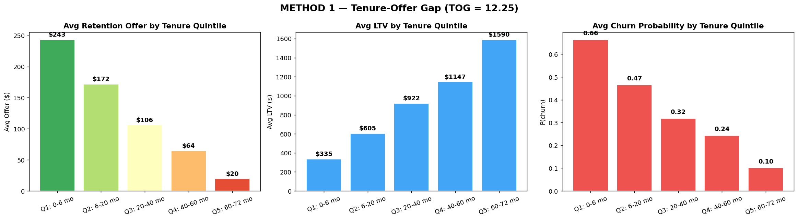

# Method 1 — Tenure-Offer Gap (TOG)

## What it is

The simplest possible audit. We sort every customer in the dataset by how long they've been with the company, cut them into 5 equal groups (quintiles), and check whether the retention system gives smaller offers to longer-tenured groups.

If it does, the ratio between the newest group's average offer and the oldest group's average offer — the **Tenure-Offer Gap** — is a one-number summary of the loyalty penalty at the aggregate level.

## Why we need it

Before running anything sophisticated, we want to answer the most basic version of the question: *"On average, do loyal customers get smaller retention offers than new customers?"*

This is the smell test. If the answer here were "no", we wouldn't need any of the other methods.

## How it works

1. Sort all 7,043 customers by `tenure` (months with the company).
2. Slice into 5 equal-sized buckets at the 20th, 40th, 60th, and 80th percentiles. Each bucket contains roughly 1,400 customers.
3. For each bucket, compute three averages using the baseline SHAP-threshold retention rule from `app.py`:
   - Average churn probability (how risky the group looks)
   - Average LTV (how much revenue they represent)
   - Average offer value (what the retention system would spend on them)
4. Compute `TOG = avg_offer(shortest_quintile) / avg_offer(longest_quintile)`.

Interpretation:
- `TOG = 1.0` → offers are balanced across tenure
- `TOG > 1.5` → loyalty penalty detected
- `TOG > 2.0` → severe loyalty penalty

## What we found

At the realistic 0.5 retention threshold:

| Quintile | Tenure range | N | Avg churn prob | Avg LTV | Avg offer |
|---|---|---|---|---|---|
| Q1 — newest | 0–6 mo | 1,371 | 0.66 | $335 | **$243** |
| Q2 | 6–20 mo | 1,436 | 0.47 | $605 | $172 |
| Q3 | 20–40 mo | 1,415 | 0.32 | $922 | $106 |
| Q4 | 40–60 mo | 1,338 | 0.24 | $1,147 | $64 |
| Q5 — loyals | 60–72 mo | 1,483 | 0.10 | $1,590 | **$20** |

**TOG = 243 / 20 = 12.25**

Newcomers are offered about 12× more retention money than the longest-tenured customers on average.

The key observation is that **LTV rises monotonically across quintiles but offer falls monotonically**. The system spends the most retention money on the group that represents the LEAST lifetime value, and the least on the group that represents the MOST.

## Diagram

### How to read it

Three side-by-side bar charts, one bar per quintile:

- **Left panel — Avg Retention Offer:** bars decrease from left to right. The red bar on the far left (newest customers) is about 12× taller than the green bar on the far right (loyalists). This is the loyalty penalty, visually.

- **Middle panel — Avg LTV:** bars *increase* from left to right. Loyalists represent roughly 5× the lifetime value of newcomers. This is the "they're worth more" panel.

- **Right panel — Avg Churn Probability:** bars *decrease* from left to right. Loyalists have about 1/7th the churn probability of newcomers. This is the "they're less risky" panel.

Putting the three panels together tells the full story: *loyal customers are worth the most, least likely to leave, and get the smallest retention investment.*

## Takeaway

The smell test flags a clear loyalty penalty at the aggregate level. But this is only the first method — a skeptic could argue "of course loyals get smaller offers, the system is just being efficient with low-risk customers." The remaining five methods are designed to rule out that objection.
