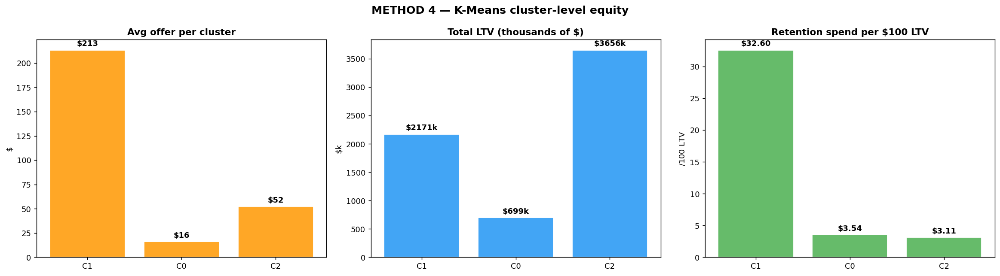

# Method 2 — K-Means Cluster Equity

## What it is

The business-value version of the audit. Instead of grouping customers by tenure alone, we use the **K-Means clusters** that Layer 2 of the existing project already built. K-Means grouped customers by their full behavioral signature (tenure, monthly bill, total charges, services subscribed, contract length, internet usage, average monthly revenue) — not just their age.

Then we ask: *for every $100 of lifetime value each cluster represents, how much does the retention system spend on them?*

## Why we need it (and how it's different from Method 1)

Method 1 groups customers by **tenure only**. A customer with 60 months of tenure on a $21 phone-only plan lands in the same bucket as a customer with 60 months of tenure on a $100 fiber + streaming bundle. Same age, very different business value.

Method 2 fixes this by using the clusters that already know the difference. K-Means found 3 natural segments:

| Cluster | Name | Profile | N |
|---|---|---|---|
| 0 | Budget Basics | Low spend, phone-only, mixed tenure | 1,542 |
| 1 | Flight Risks | Month-to-month, mid-spend, short tenure | 3,317 |
| 2 | Premium Loyalists | Long tenure, high bills, many services | 2,184 |

By grouping customers this way instead of by age alone, Method 2 can answer a question Method 1 can't: *"Is our most valuable customer segment being under-served per dollar of value they represent?"*

That's the business version of the loyalty penalty, and it's the version a regulator or executive would care about.

## How it works

1. Take the K-Means cluster assignments from Layer 2 (already computed, already saved in `all_artifacts.pkl`).
2. For each cluster, compute:
   - `total_spend` = sum of retention offers across everyone in the cluster
   - `total_ltv` = sum of LTV proxies across everyone in the cluster
   - `spend_per_100_LTV` = `(total_spend / total_ltv) × 100`
3. Compare the spend-per-LTV of each cluster. If the most valuable cluster gets much less retention spend per LTV dollar than a less valuable cluster, the segment is being under-served.

## What we found

At the realistic 0.5 retention threshold:

| Cluster | N | Avg tenure | Avg monthly | Churn rate | Total LTV | Total spend | **Spend per $100 LTV** |
|---|---|---|---|---|---|---|---|
| Budget Basics | 1,542 | 31 mo | $21 | 7% | $454k | $16k | **$3.54** |
| Flight Risks | 3,317 | 16 mo | $69 | 44% | $2.17M | $708k | **$32.60** |
| Premium Loyalists | 2,184 | 58 mo | $90 | 14% | $2.87M | $89k | **$3.11** |

Premium Loyalists get **$3.11** of retention investment per $100 of LTV they represent. Flight Risks get **$32.60** per $100 of LTV. That's a **10× disparity**.

The group generating the most revenue per customer (Premium Loyalists) gets the lowest retention investment per dollar of value. The group generating less revenue per customer but churning the most (Flight Risks) gets 10× more — because the SHAP-threshold system fires heavily on their high churn probability.

## Diagram

### How to read it

Three side-by-side bar charts, one bar per cluster (C0, C1, C2):

- **Left panel — Avg offer per cluster:** Flight Risks (C1) tower above everyone else at $213. Budget Basics and Premium Loyalists are both around $50 or less. This is where the money goes.

- **Middle panel — Total LTV (in thousands):** Premium Loyalists (C2) represent the most LTV by a wide margin — nearly $2.87M. This is the revenue that should be protected.

- **Right panel — Retention spend per $100 LTV:** The killer panel. Flight Risks get $32.60 per $100 LTV. Premium Loyalists get $3.11. For every dollar of business value they represent, Premium Loyalists receive about 1/10th the retention investment Flight Risks receive.

Looking at the middle and right panels together: **the cluster with the most to protect gets the least protection per dollar at risk**.

## Method 1 vs Method 2 — the direct comparison

| | Method 1 (TOG) | Method 2 (Cluster Equity) |
|---|---|---|
| How it groups customers | By tenure quintile (1 dimension) | By K-Means cluster (7 dimensions) |
| What it compares | Average offer per group | Spend ÷ LTV per group |
| What it answers | "Does tenure predict smaller offers?" | "Do our most valuable customers get under-served per dollar of value?" |
| Who it speaks to | Data scientists doing the audit | Executives, regulators, business stakeholders |
| Can it separate "old and cheap" from "old and valuable"? | No — it lumps them together | Yes — Budget Basics is its own cluster |
| Main finding | TOG = 12.25 (newcomers get 12× more) | 10× disparity in spend-per-LTV (Flight vs Premium) |

Both methods find the same loyalty penalty. Method 1 is simpler and frames it as "age bias". Method 2 is richer and frames it as "value mismatch". Having both means our finding survives under two different ways of defining customer groups.

## Takeaway

Method 2 confirms Method 1 with a stronger business framing: the retention system is structurally misallocating budget away from the most valuable customer segment. This makes the case for the Phase 3 mitigation work: we need to redirect retention spend toward customers based on their value, not just their risk.
