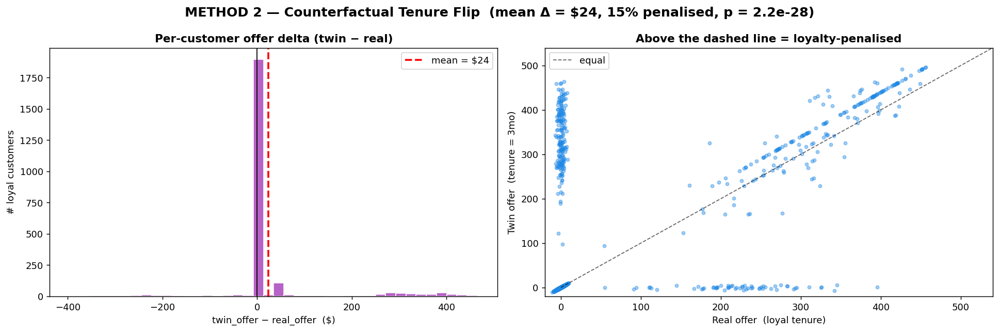

# Method 3 — Counterfactual Tenure Flip

## What it is

A **per-person** causal test. For each loyal customer, we create an exact copy of them — same contract, same monthly bill, same services, same demographics — except we change **only** their tenure to a short value like 3 months. Then we run both versions through the retention system.

If the twin (the "fake newcomer" version) gets a larger offer than the real customer, then the **same individual** is being treated better when the system sees them as a newcomer. That's direct, per-customer evidence of the loyalty penalty.

## Why we need it

Methods 1 and 2 are group-level. They show that, on average, loyal customers get smaller offers. But a skeptic could say: *"Those are aggregate comparisons. You can't point at any specific customer and prove they're being penalized. Maybe the groups differ for reasons unrelated to tenure."*

Method 3 answers that by running the test on each customer individually. Every loyal customer is compared against **their own twin**, not against other people's averages. That's the strongest form of the loyalty-penalty claim you can make without a randomized experiment.

## How it works

1. Identify the loyal subset: customers with tenure ≥ 48 months. Result: 2,303 customers.
2. For each loyal customer `i`:
   - Take their real 19-feature vector `x_i`.
   - Create a twin `x'_i` that's identical to `x_i` except tenure is set to 3 months. **Only tenure is changed** — contract, services, monthly bill, and everything else are preserved exactly as they are.
   - Run the XGBoost churn model on both to get `P(churn)_real` and `P(churn)_twin`.
   - Run the SHAP-threshold retention rule on both to get `offer_real` and `offer_twin`.
   - Compute `delta_i = offer_twin - offer_real`.
3. A customer with `delta > 0` is a **victim**: their twin would have been offered more than they were.
4. Summarize:
   - Mean delta across loyal customers
   - Median delta
   - Percentage of loyal customers with `delta > 0`
   - Paired t-test p-value testing whether mean delta is significantly different from zero

The "only tenure is flipped" constraint is crucial. If we flipped tenure AND contract, we couldn't tell whether the offer change came from the tenure flip or the contract flip. By holding everything else constant, any difference is causally attributable to tenure alone, under the model.

## What we found

At the 0.5 retention threshold:

| Metric | Value |
|---|---|
| Loyal customers audited | 2,303 |
| Mean offer delta | **$24** |
| Median offer delta | $0 |
| % of loyal customers penalized (delta > 0) | **15%** |
| Paired t-test p-value | **2.2e-28** (effectively zero) |

**Interpretation.** For the average loyal customer, their twin would be offered $24 more. The p-value tells us this is not a chance result — if we ran the same experiment on a world without a loyalty penalty, we'd essentially never see a mean delta this large. 15% of loyal customers have a strictly positive delta, and for some of them the delta runs into the hundreds of dollars.

**Median $0 but mean $24 → the penalty is concentrated.** Most loyal customers (the 85% with delta = 0) don't benefit from either version — they're invisible to the retention system in both worlds. But a specific ~15% subgroup, when flipped to newcomer status, becomes highly visible and gets a large retention bundle. These are the **"sleeping loyalists"** the profile analysis identifies: long-tenured, high-paying fiber customers on month-to-month or 1-year contracts who sit quietly in the system today.

**Top 5 examples:**

| Row | Tenure | Contract | Monthly | P(churn) real | P(churn) twin | Offer real | Offer twin | Delta |
|---|---|---|---|---|---|---|---|---|
| 4697 | 72 | Month-to-month | $95 | 0.08 | 0.52 | $0 | $465 | $465 |
| 4257 | 49 | Month-to-month | $99 | 0.24 | 0.63 | $0 | $460 | $460 |
| 4835 | 65 | Month-to-month | $104 | 0.45 | 0.80 | $0 | $460 | $460 |
| 2836 | 49 | Month-to-month | $99 | 0.47 | 0.73 | $0 | $460 | $460 |
| 522 | 55 | Month-to-month | $86 | 0.38 | 0.84 | $0 | $450 | $450 |

These are real customers from the dataset. Each one is a loyal, high-paying customer on a flexible contract. The real version of them currently gets $0 from the retention system. The synthetic 3-month-tenure version of the same person would get $450 or more.

## Diagram

### How to read it

Two panels:

- **Left — histogram of per-customer deltas.** The x-axis is `offer_twin - offer_real` in dollars; the y-axis is how many loyal customers have that delta. A big spike at zero (the 85% who are ignored in both worlds) and a long right tail of victims with deltas of $200–$500. The red dashed vertical line is the mean (~$24). The fact that the distribution is one-sided — almost no bars to the left of zero — is visually how you see the asymmetry: the flip never makes things worse for loyalists, only better.

- **Right — scatter plot of `offer_real` (x-axis) vs `offer_twin` (y-axis).** Each dot is one loyal customer. The black dashed line is the "equal" diagonal (`offer_twin = offer_real`). Points ABOVE the diagonal are loyalty-penalized (their twin gets more). Points ON the diagonal are customers where tenure doesn't matter. Almost all dots are at `(0, 0)` or above the line — almost none are below. This is the loyalty penalty visible at a glance: the scatter is stuck to the top-left triangle.

## Takeaway

Method 3 is the strongest single piece of evidence. Because we compare each customer against their own twin, the result can't be explained away by "loyal customers are just different from new ones." We hold every other feature constant and still see an offer change. The paired t-test p-value confirms this isn't noise.

The concentrated nature of the penalty (15% of loyals take a big hit, 85% take no hit) also informs Phase 3: a flat "everyone gets a loyalty bonus" would waste budget on the 85%. A targeted fix aimed at the 15% is much more efficient, and Method 6 (the victim predictor) shows we can identify them in advance.
