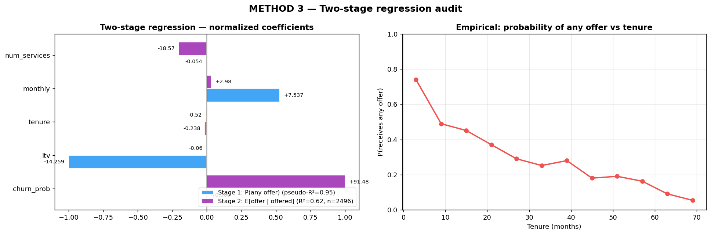

# Method 4 — Two-Stage Regression Audit

## What it is

A statistical control test that rules out the most natural defense against the loyalty-penalty claim: *"loyal customers get smaller offers because they're lower risk, not because they're being penalized."*

We fit a regression model where offer size is explained by several variables at once — churn probability, LTV, tenure, monthly charges, and number of services. If tenure independently predicts smaller offers **even after** accounting for churn probability and LTV, then tenure is doing something beyond just proxying for risk. That "something" is the penalty.

The model is split into two stages because the retention system has a hard cutoff — customers below a churn-probability threshold get $0 — and mixing $0 customers with non-zero customers confuses the statistics.

## Why we need it

The skeptic's argument: *"Of course loyal customers get smaller offers. They're low-risk, and a well-designed retention system should invest less in customers who are less likely to leave. Your loyalty penalty is just risk-based targeting working as intended."*

This argument is superficially reasonable. If it were true, we'd expect that once we know a customer's churn probability, their tenure shouldn't add any further information about offer size — churn probability alone should be sufficient. If tenure still carries independent explanatory power after we condition on churn probability, the argument fails.

Method 4 is the test of that argument.

## How it works

### The two stages

**Stage 1 — selection.** *Does tenure make a customer less likely to receive any offer at all?*

- Outcome: binary `offered = 1` if `offer > 0`, else `0`.
- Inputs: tenure, LTV, monthly charges, number of services. (Churn probability is excluded here because it mechanically determines the filter — `P(churn) ≥ 0.5 → eligible` — and including it causes the logistic regression to diverge due to perfect separation.)
- Model: scikit-learn `LogisticRegression` with standardized features. P-values estimated via 200 bootstrap resamples.
- Interpretation: a negative coefficient on tenure means longer tenure makes you less likely to receive any offer.

**Stage 2 — dosage.** *Among the customers who do get an offer, does tenure reduce the amount?*

- Outcome: continuous `offer` value.
- Subset: only customers with `offer > 0`.
- Inputs: churn probability, LTV, tenure, monthly charges, number of services.
- Model: `statsmodels` OLS regression.
- Interpretation: a negative coefficient on tenure means longer tenure makes the offer smaller, given the customer is being offered something.

### Why split into two stages

At the 0.5 retention threshold, most loyal customers get `offer = $0`. A single regression that mixes $0 and positive-offer customers can't tell apart two distinct phenomena: whether tenure keeps you out of the offer pool versus whether tenure shrinks the offer once you're in it.

The split makes each stage unambiguous. Stage 1 asks the first question, Stage 2 the second. Both can independently reveal a penalty, and in our case both do.

## What we found

### Stage 1 — P(any offer | features)

| Variable | Coefficient | Direction | p-value |
|---|---|---|---|
| ltv | −14.26 | negative | ~0 |
| **tenure** | **−0.24** | **negative** | **~0** |
| monthly | +7.54 | positive | ~0 |
| num_services | −0.05 | flat | 0.68 |

Pseudo-R² ≈ 0.95. The Stage 1 model explains who gets offered anything with near-perfect accuracy. The tenure coefficient is negative and bootstrapped to essentially zero p-value: **tenure independently reduces the probability of being offered anything**, holding LTV, monthly charges, and services constant.

### Stage 2 — E[offer | offered, features]

| Variable | Coefficient | p-value |
|---|---|---|
| churn_prob | +91.48 | 0.0002 |
| ltv | −0.06 | ~0 |
| monthly | +2.98 | ~0 |
| **tenure** | **−0.52** | **2.2e-14** |
| num_services | −18.57 | ~0 |

R² = 0.62 on the subset of ~2,500 customers who got an offer. Tenure has a negative coefficient of roughly −$0.52 per month of tenure: among customers who are offered something, each additional month of tenure is associated with a ~$0.52 smaller offer, holding everything else constant.

### Both stages confirm the penalty

Both stages find tenure depresses offers independently of risk. The two effects compound:

- **Stage 1 says loyalty makes you invisible.** Longer-tenured customers are less likely to be offered anything at all.
- **Stage 2 says that even when loyalty doesn't make you invisible, it shrinks your offer.** If somehow you do get into the offer pool, your tenure still pulls the amount down.

The combined picture: tenure hurts you at both the gate (getting considered for an offer) and the checkout (how much the offer is worth).

## Diagram

### How to read it

Two panels:

- **Left — two-stage coefficients (normalized).** Each variable has two bars: Stage 1 (red/blue) and Stage 2 (orange/purple). The bars are normalized so the magnitudes are comparable visually. The key bar is **tenure**, colored red in Stage 1 and orange in Stage 2, showing negative values in both. All other variables behave intuitively — churn probability is positive (higher risk → bigger offer), monthly is positive (more expensive plan → bigger offer). Only tenure and LTV are negative in both stages, and LTV's negative effect is partly tautological (high-LTV customers are by definition low-churn-probability, so they rarely reach the offer stage).

- **Right — empirical P(any offer) vs tenure.** A curve showing, for each 6-month tenure bucket, the fraction of customers in that bucket who received any offer. The curve falls from roughly 90% (newcomers) to below 10% (60+ months). This is the Stage 1 finding visualized directly: as tenure rises, the probability of being offered anything collapses.

## Takeaway

Method 4 is the statistical proof that the loyalty penalty is not just risk-based targeting in disguise. Even after conditioning on churn probability and LTV, tenure independently and significantly pushes offers down in both stages.

This matters for the thesis because it preempts the most likely critical objection. A reader who looks at Method 1 (Tenure-Offer Gap) and says "but those groups differ in risk, so of course offers differ" can't say the same about Method 4. The regression has already controlled for risk. The penalty is real, not an artifact of risk scoring.
