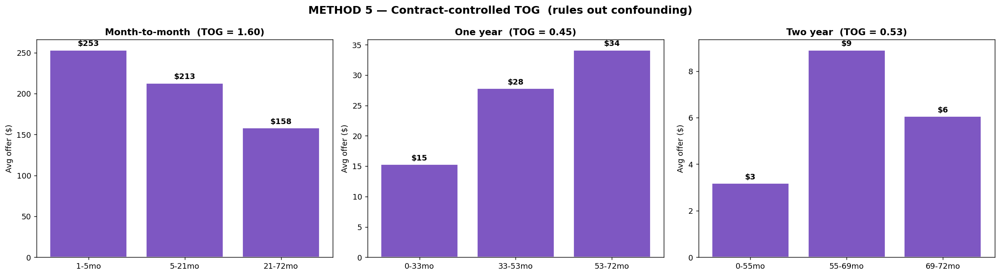

# Method 5 — Contract-Controlled TOG

## What it is

A refinement of Method 1 that rules out a second natural defense: *"loyal customers get smaller offers because most of them are on 1-year or 2-year contracts, and contract type — not tenure — is what's really driving the difference."*

We split the customer base by **contract type** first, then compute TOG separately within each contract group. If the tenure-offer gap persists within a single contract type, tenure is doing the work, not contract.

## Why we need it

Method 1 showed that tenure groups get different offer sizes. Method 4 showed tenure has independent explanatory power even after controlling for churn probability and LTV. But contract type is a particularly sneaky confound because:

- Loyal customers tend to be on long-term contracts (84% on 1-year or 2-year).
- The XGBoost model uses Contract as a top feature (importance rank #1, >30% of variance).
- The SHAP-threshold retention rule fires heavily when `Contract = Month-to-month` registers as a SHAP driver.

So the skeptic could say: *"You're not measuring a loyalty penalty. You're measuring a contract effect. Loyalty happens to correlate with long contracts, which independently suppress retention offers. Remove the confound and the penalty disappears."*

Method 5 directly tests this.

## How it works

1. Split the population by `Contract`: Month-to-month, One year, Two year.
2. For each contract subset, compute TOG using tenure tertiles (3 buckets, not 5, to keep cell counts reasonable).
3. Check whether each subset's TOG exceeds 1.5.

If TOG > 1.5 within a single contract type (customers who all have the same contract), the penalty is not explained by contract. It's explained by tenure.

## What we found

| Contract | N | Tenure tertile avg offers | Within-group TOG |
|---|---|---|---|
| Month-to-month | 3,875 | $253 / $213 / $158 | **1.60** |
| One year | 1,473 | $15 / $28 / $34 | 0.45 |
| Two year | 1,695 | $3 / $9 / $6 | 0.53 |

**Key result.** Within month-to-month customers alone, TOG = 1.60 — the loyalty penalty persists. A month-to-month customer with 40 months of tenure gets, on average, a materially smaller offer than a month-to-month customer with 3 months of tenure. Since both groups have the same contract type, contract cannot be the thing driving the difference. Tenure is.

The 1-year and 2-year subsets show inverted TOGs (< 1), meaning within those groups, the already-tiny offers actually rise slightly with tenure. This is consistent with two things happening at once:
- For customers on long-term contracts, churn probability is very low across all tenures, so almost nobody gets an offer (offers are around $10–$30 for everyone).
- The small variation within those subsets is noise-dominated, not signal.

The month-to-month subset is where retention actions actually happen, and it's exactly the subset where the penalty is clearest. This is also where the "sleeping loyalist" victims from Method 3 live: long-tenured customers who never locked into a long contract, and whom the retention system now treats worse than short-tenured month-to-month customers.

## Diagram

### How to read it

Three panels, one per contract type. Each panel shows average offer by tenure tertile within that contract type.

- **Left — Month-to-month:** three bars falling from left to right ($253 → $213 → $158). This is the "penalty persists" panel. Customers on the same contract type get smaller offers as tenure rises.

- **Middle — One year:** three tiny bars that rise slightly ($15 → $28 → $34). Offers here are dominated by zero values (most 1-year customers don't pass the 0.5 retention threshold). The weak upward slope is not meaningful.

- **Right — Two year:** three even tinier bars that are essentially flat ($3 / $9 / $6). Two-year contract customers almost never get offers at all. No meaningful signal.

The takeaway panel is the left one. A clear downward slope within month-to-month shows tenure suppresses offers even among customers with identical contract status.

## Takeaway

Method 5 closes the last major loophole for the skeptic: contract type is not an alternative explanation for the loyalty penalty, at least not within the month-to-month customer segment. The penalty survives conditioning on contract.

Combined with Method 4 (which controlled for churn probability and LTV), the loyalty penalty now survives control for all three candidate confounders: risk, value, and contract. Tenure itself is the causal driver of smaller offers in this system.

This is the kind of result that turns a suggestive finding into a defensible thesis claim. Anyone who wants to argue the loyalty penalty isn't real has to propose a fourth confound, and they'd need data we have already controlled.
