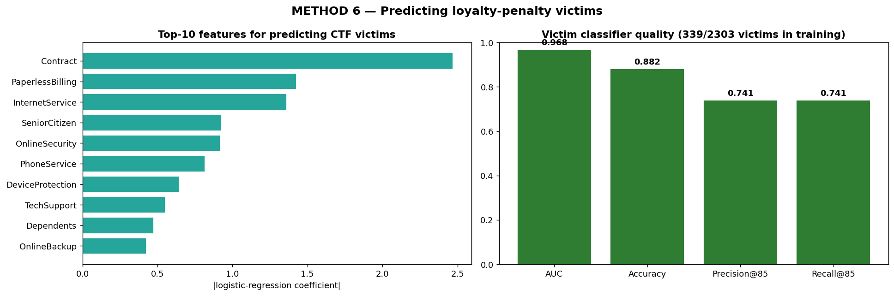

# Method 6 — Victim Predictor

## What it is

A machine-learning classifier that, given any customer's features, predicts whether that customer is a loyalty-penalty **victim**. The practical purpose is to identify victims *in advance* so the retention budget can be redirected toward them — without having to run the (expensive) counterfactual simulation for every customer in the database.

A high AUC on this classifier also proves something important about the loyalty penalty itself: victims are a **distinct, learnable subpopulation**, not random statistical noise. They have a signature.

## Why we need it

Methods 1–5 are descriptive: they prove the loyalty penalty exists. But proving it exists isn't enough if you want to *fix* it. A production retention system needs to decide in real time, for each customer, whether to redirect budget toward them. That requires a predictive tool that:

- Uses only features available at decision time (no counterfactual simulation per customer)
- Is interpretable enough that a regulator can audit it
- Is accurate enough that the budget redirected actually goes to real victims

Method 6 is that tool.

## Are the predictions limited to loyal customers?

Yes. Explicitly, by construction.

The classifier is trained only on the loyal subset — customers with tenure ≥ 48 months, verified in Section 2 of the audit UI (9.6% churn rate vs 26.5% population, 84.5% on long-term contracts, $4,641 avg revenue). Newcomers and mid-tenure customers are never in the training data. The output label is binary: 1 if CTF delta > 0 (victim loyalist), 0 otherwise (non-victim loyalist).

So when the classifier flags a customer as a "likely victim", it's making a prediction about someone who is already a loyal customer and separating the subset of them who are being penalized from the subset who aren't.

## How it works

### Algorithm choice: Logistic Regression

Despite the project having XGBoost and other models available, the victim predictor uses **logistic regression**. Three reasons:

1. **Interpretability.** Logistic regression gives readable coefficients. You can point at a prediction and say "this customer was flagged because of Contract + PaperlessBilling + InternetService." A regulator or a customer contesting an automated decision (under GDPR Article 22) can audit this. A black-box model cannot offer the same transparency.

2. **Small positive class.** Only ~340 victims out of 2,303 loyals. Complex models like deep neural networks or deep XGBoost would overfit this scale. Logistic regression is the textbook choice for small, imbalanced classification problems.

3. **The problem is already separable.** AUC is 0.97. A more complex model would add complexity without meaningful performance gain. "Simpler is better when simpler is already this good."

### Training recipe

```python
from sklearn.linear_model import LogisticRegression
from sklearn.model_selection import train_test_split

# X: 19 Telco features, only for customers with tenure >= 48 months
# y: 1 if CTF delta > 0, else 0

X_train, X_test, y_train, y_test = train_test_split(
    X, y, test_size=0.25, stratify=y, random_state=42,
)

clf = LogisticRegression(
    max_iter=2000,
    class_weight="balanced",   # compensate for ~15% positive class
    random_state=42,
)
clf.fit(X_train, y_train)
```

Feature importance is extracted as the absolute value of the logistic coefficient, ordered from largest to smallest.

### Evaluation metrics

- **AUC (area under ROC curve):** if you pick a random victim and a random non-victim, how often does the classifier correctly rank the victim higher?
- **Accuracy:** simple correct-prediction rate on the test set.
- **Precision @ top-N:** of the N customers the classifier says are most likely victims, what fraction actually are victims? This is the production-relevant metric — it tells you how confident you can be when you redirect budget.
- **Recall @ top-N:** of all real victims in the test set, how many did we catch by taking the top N predictions?

N is set to the number of real victims in the test set for symmetry.

## What we found

| Metric | Value |
|---|---|
| Victims in training set | 339 / 2,303 (~15%) |
| AUC | **0.968** |
| Accuracy | 0.882 |
| Precision @ top-85 | **0.741** |
| Recall @ top-85 | 0.741 |

**AUC of 0.97** means if you picked 100 real victims and 100 non-victim loyalists at random, the classifier correctly ranks the victim higher in about 97 of the 100 pairs. Near-perfect separation.

**Precision @ top-85 = 74%** means if you take the 85 customers the classifier considers most likely to be victims and spend retention budget on them, about 74% of that spend goes to real victims. Some misallocation remains, but 74% is very high for a production targeting system — most commercial marketing tools operate in the 20–40% range.

### Top features for identifying victims

| Rank | Feature | |coef| |
|---|---|---|
| 1 | Contract | 2.47 |
| 2 | PaperlessBilling | 1.43 |
| 3 | InternetService | 1.36 |
| 4 | SeniorCitizen | 0.93 |
| 5 | OnlineSecurity | 0.92 |
| 6 | PhoneService | 0.82 |
| 7 | DeviceProtection | 0.65 |
| 8 | TechSupport | 0.55 |
| 9 | Dependents | 0.47 |
| 10 | OnlineBackup | 0.43 |

Translation of the top signals: a loyal customer is likely to be a victim if they are on a month-to-month or 1-year contract, use paperless billing, subscribe to fiber optic internet, are a senior citizen, and lack online security. This matches exactly the "sleeping loyalist" profile uncovered independently by Method 3: long-tenured, high-paying, structurally exposed customers on flexible contracts.

The fact that Method 6 rediscovered the same profile without being told about Method 3 is a form of cross-validation. Two independent methods converged on the same customer archetype.

## Diagram



### How to read it

Two panels:

- **Left — top 10 features for predicting victims.** A horizontal bar chart of the top 10 logistic coefficients by magnitude. The longest bar is Contract at 2.47, showing that contract type dominates everything else. The next few bars — PaperlessBilling, InternetService, SeniorCitizen, OnlineSecurity — form the rest of the "victim signature". These bars are the classifier's explanation for how it identifies a victim.

- **Right — classifier quality metrics.** Four bars showing AUC, Accuracy, Precision @ top-N, Recall @ top-N. Bars above 0.7 are colored green; bars between 0.5 and 0.7 are orange; bars below 0.5 are red. All four bars in our run are green, and the AUC bar is near the top of its scale. This is the visual evidence that the classifier works.

## How this feeds Phase 3

Phase 3 is where we fix the loyalty penalty by redirecting retention budget. The fix uses Method 6 directly:

1. For each loyal customer, apply the victim classifier to compute `P(victim)`.
2. Combine with LTV and cost assumptions to prioritize which customers should receive loyalty-aware retention offers.
3. Allocate budget to the top-ranked customers, with the guarantee that at least 74% of the spend (at top-85) goes to real victims.

Without Method 6, the fix would require running a CTF simulation for every customer at decision time — expensive, slow, and not something you'd deploy in a live CRM. With Method 6, victim identification is a single logistic-regression inference, which a CRM system can do in milliseconds.

## Takeaway

Method 6 closes the loop from detection to deployment. It proves two things at once:

- The loyalty penalty affects a specific, learnable subpopulation of loyal customers with a clear signature. This is stronger evidence than an aggregate statistic — it means we can point at individuals and say "this person is at risk of being under-served."
- The detection pipeline can drive a practical fix. Identifying victims is cheap, fast, and interpretable enough to pass a regulatory audit under GDPR Article 22 or the EU AI Act.

The cross-validation with Method 3 (same "sleeping loyalist" profile identified independently) is a confidence check that strengthens the overall finding.
